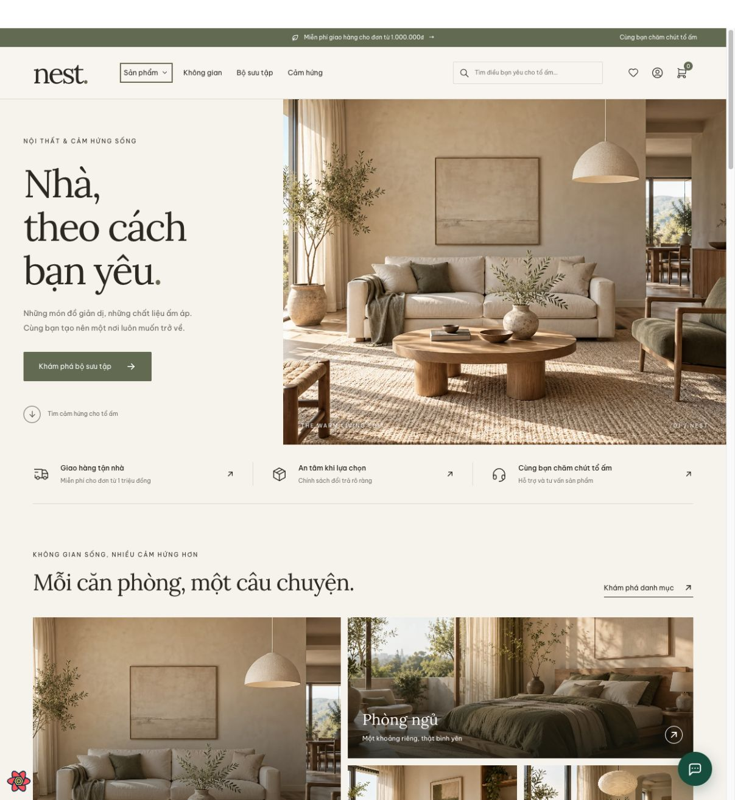
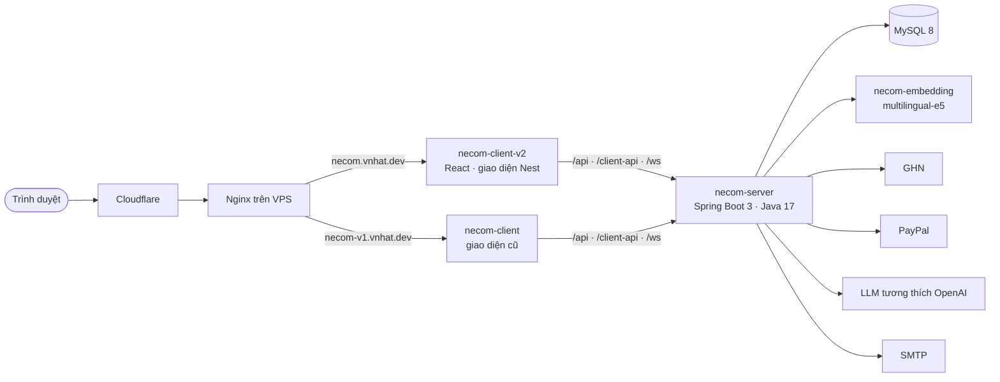
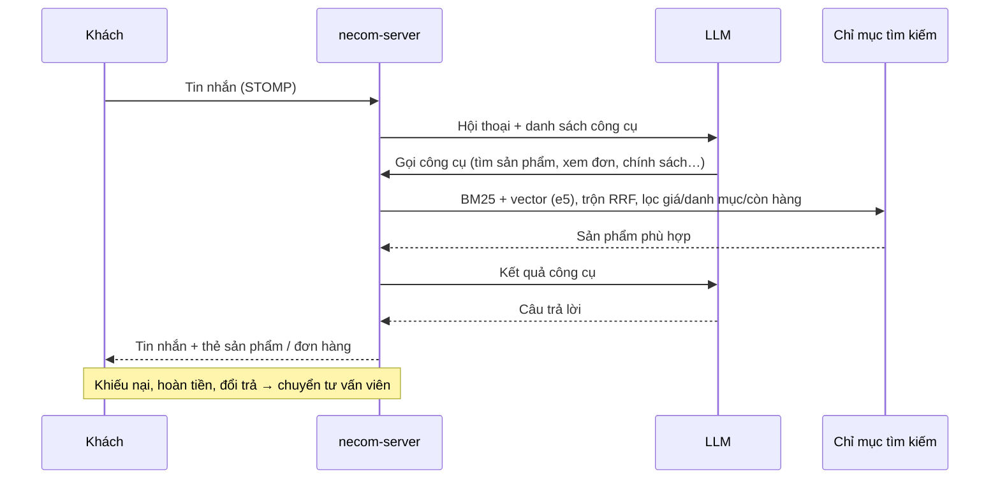
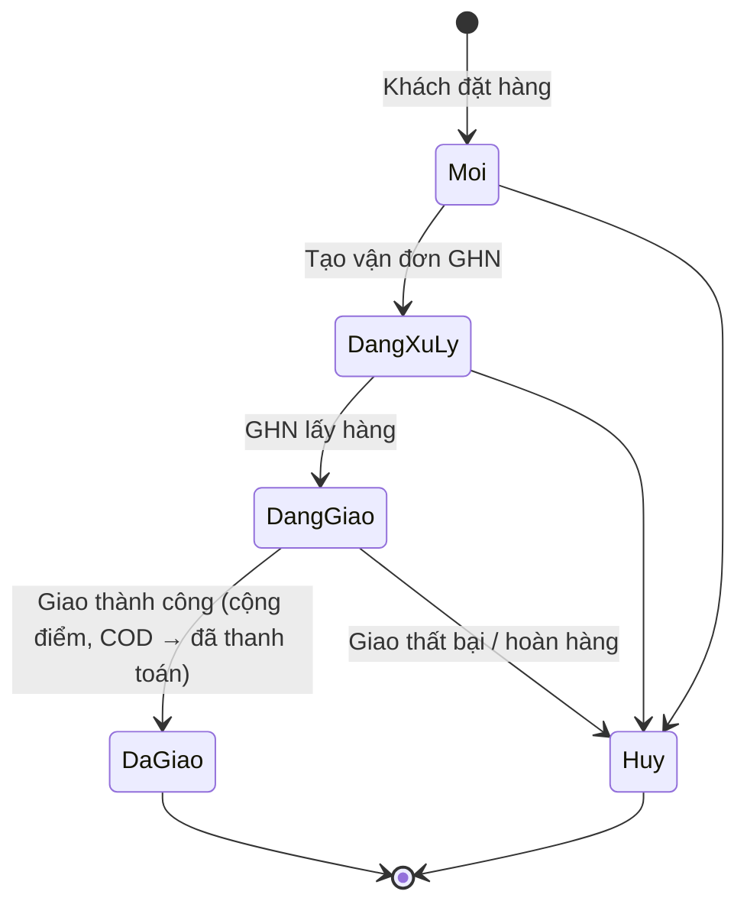

# Necom · Nest Commerce

Website thương mại điện tử nội thất & đời sống: cửa hàng cho khách, trang quản trị cho nhân viên, kho vận, giao hàng GHN, thanh toán PayPal/COD, điểm thưởng và chat chăm sóc khách hàng có trợ lý AI.

**Web:** [necom.vnhat.dev](https://necom.vnhat.dev) · **Tài liệu:** [necom.vnhat.dev/documentation](https://necom.vnhat.dev/documentation) · **Quản trị:** [necom.vnhat.dev/admin](https://necom.vnhat.dev/admin)



## Dự án là gì

Necom mô phỏng một cửa hàng nội thất trực tuyến hoàn chỉnh, từ lúc khách tìm sản phẩm đến khi hàng được giao:

- **Khách hàng** duyệt ~300 sản phẩm theo danh mục, không gian, bộ sưu tập; lọc theo giá, thương hiệu; thêm giỏ hàng, đặt hàng với địa chỉ 34 tỉnh/thành sau sáp nhập, thanh toán COD hoặc PayPal, theo dõi đơn, đánh giá, tích điểm.
- **Trợ lý AI** trả lời câu hỏi về sản phẩm, chính sách và đơn hàng của chính khách (tìm kiếm lai BM25 + vector), chuyển sang tư vấn viên khi khách cần người thật.
- **Nhân viên** xử lý đơn, tạo vận đơn GHN, quản lý tồn kho (nhập/xuất/chuyển/kiểm kê), duyệt đánh giá, trả lời khách trong hộp thư CSKH.
- **Quản trị viên** có thêm quyền quản lý sản phẩm, nhân sự, khuyến mãi, chiến lược điểm thưởng.

Chi tiết nghiệp vụ, sơ đồ use case, mô hình dữ liệu, API và vận hành nằm ở trang [/documentation](https://necom.vnhat.dev/documentation).

## Kiến trúc



- **REST + realtime:** CRUD quản trị qua `/api/{resource}` (lọc RSQL), API cửa hàng qua `/client-api`, chat qua STOMP/SockJS `/ws`, thông báo qua SSE.
- **Bảo mật:** JWT (Spring Security 6), phân quyền `ADMIN` / `EMPLOYEE` / `CUSTOMER`.
- **Hai giao diện, một backend:** giao diện Nest (nhánh `main`) là bản chính; giao diện cũ giữ ở nhánh `ui-v1`.

### Trợ lý AI trả lời như thế nào



### Vòng đời đơn hàng



## Công nghệ

| Phần | Công nghệ |
|---|---|
| Frontend | React 17, TypeScript, Mantine 4, React Query, Zustand, React Router 6 |
| Backend | Spring Boot 3.5, Java 17, Spring Security 6 + JWT, Spring Data JPA (Hibernate 6), MapStruct, RSQL, springdoc |
| Dữ liệu | MySQL 8; schema, dữ liệu mẫu và migration dạng file SQL (`necom-server/src/main/resources`) |
| AI | LLM qua API tương thích OpenAI (function calling), embedding `multilingual-e5-small` (ONNX, FastAPI) |
| Tích hợp | Giao Hàng Nhanh, PayPal Sandbox, SMTP |
| Hạ tầng | Docker Compose, Nginx, Cloudflare, VPS |

## Cấu trúc repo

```
necom-client/      React SPA (cửa hàng + trang quản trị)
necom-server/      Spring Boot API, SQL seed và migration trong src/main/resources
necom-embedding/   Dịch vụ embedding ONNX cho tìm kiếm ngữ nghĩa
docs/design/       Thiết kế giao diện Nest (ảnh, ghi chú)
docker-compose.yml Toàn bộ dịch vụ
run.sh             Chạy local theo đúng thứ tự phụ thuộc
deploy-vps.sh      Build và deploy lên VPS
```

## Chạy local

Yêu cầu: Docker, Java 17, Node 18+.

```bash
cp .env.example .env    # điền khóa GHN, PayPal, LLM nếu cần (không commit)
./run.sh                # dựng MySQL → server → client
./run.sh status         # kiểm tra sức khỏe
./run.sh logs server    # xem log backend
./run.sh stop
```

| Dịch vụ | Địa chỉ |
|---|---|
| Cửa hàng | http://localhost |
| Quản trị | http://localhost/admin |
| API | http://localhost:8085/api |
| Swagger | http://localhost:8085/swagger-ui/index.html |

Phát triển frontend riêng: `cd necom-client && npm install && npm start` (cổng 3000, gọi API ở 8085).

## Tài khoản demo

Mật khẩu chung: `admin123`

| Tài khoản | Vai trò | Vào từ |
|---|---|---|
| `admin` | Quản trị viên | `/admin` |
| `employee` | Nhân viên | `/admin` |
| `customer` | Khách hàng | `/signin` |

## Deploy

```bash
./deploy-vps.sh              # build + deploy toàn bộ (backend, hai giao diện)
./deploy-vps.sh --only-be    # chỉ backend
./deploy-vps.sh --only-fe    # giao diện Nest → necom.vnhat.dev
./deploy-vps.sh --only-fe-v1 # giao diện cũ (nhánh ui-v1) → necom-v1.vnhat.dev
./deploy-vps.sh --status
```

Cấu hình bí mật (khóa API, mật khẩu DB) chỉ nằm trong `.env` trên máy và trên VPS, không commit vào repo.

## Nhánh

| Nhánh | Nội dung |
|---|---|
| `main` | Spring Boot 3 + giao diện Nest (đang chạy trên necom.vnhat.dev) |
| `ui-v1` | Giao diện cửa hàng cũ (necom-v1.vnhat.dev) |
| `legacy` | Bản Spring Boot 2 trước khi nâng cấp |
| `inception` | Lịch sử phát triển ban đầu của dự án |

## Tác giả

[Nhật Côi](https://github.com/nhatcoi)
